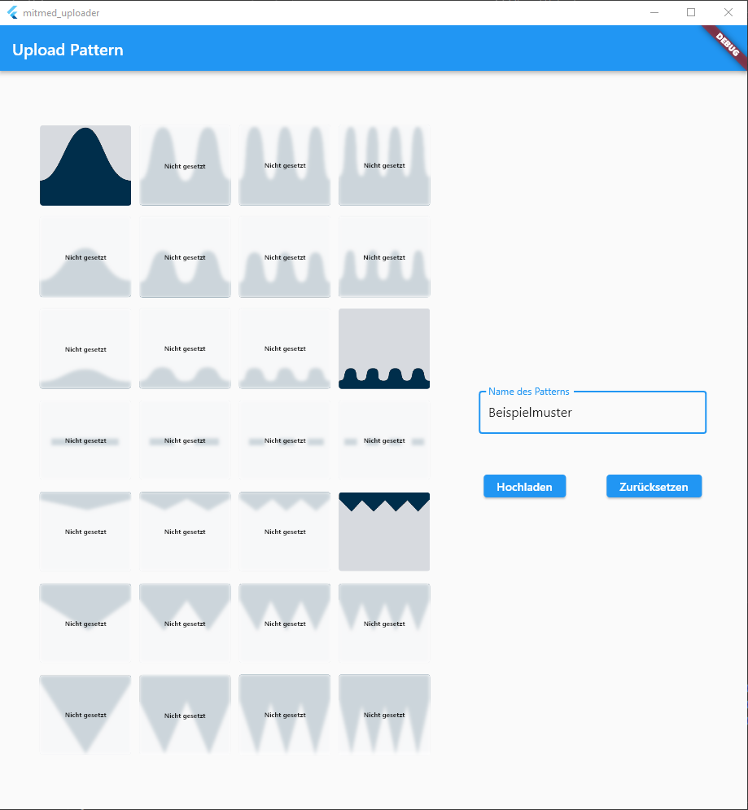
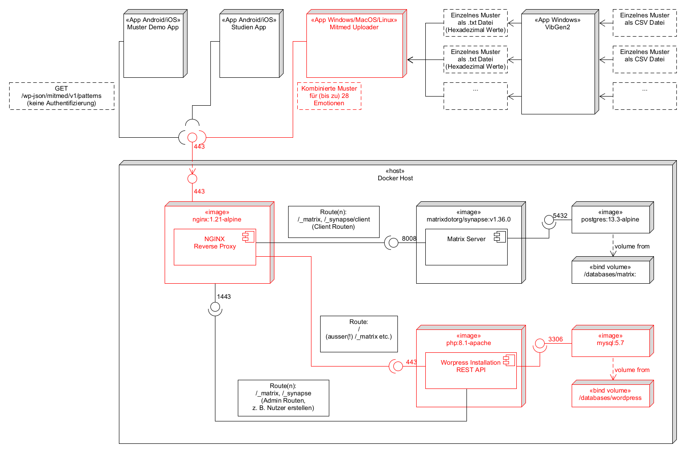

# MITMed Uploader
Entwickelt um die mit dem [Vibgen2](../Mustergenerator/) erstellten Einzelmuster den 28 Emotionen zuzuordnen und die zusammengestellten Daten unter einem Bezeichner an den Server der Vorstudie zu übertragen (siehe [Repository "wp_plugin"](https://gitlab.gwdg.de/chair-of-information-management/mitmed-project/wp_plugin))

Die vom [Vibgen2](../Mustergenerator/) erzeugten .txt Dateien enthalten jeweils ein Vibrationsmuster. Um dieses einer der 28 auswählbaren Emotionen zuzuordnen können die Dateien per Drag-and-Drop auf die Symbole / Stellen gezogen werden. 

Beim Hochladen unter dem Bezeichner wird ein eventuell vorhandenes Gesamt-Muster des selben Namens überschrieben.

Die Gesamtmuster können später u. a. in der [BLE Beispiel App](https://gitlab.gwdg.de/chair-of-information-management/mitmed-project/app_ble_communication) ausgewählt und an die Manschette übertragen werden.

Bei der im Rahmen der [Vorstudie verwendeten App](https://gitlab.gwdg.de/chair-of-information-management/mitmed-project/study_app) kann ein Standard-Muster über die Wordpress-Seite festgelegt werden (siehe [Repository "wp_plugin"](https://gitlab.gwdg.de/chair-of-information-management/mitmed-project/wp_plugin))

## Screenshot

## Schema aktuelles Setup Vorstudie

