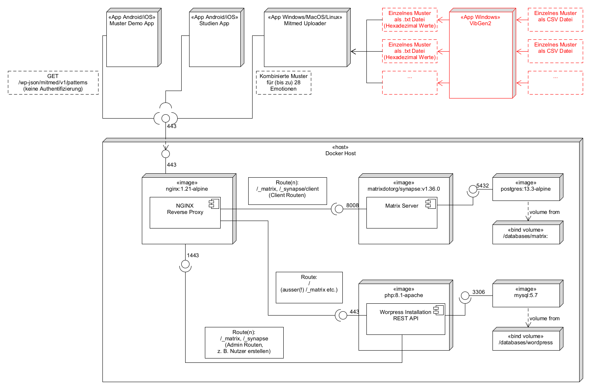

# Mustergenerator (Vibgen2)

## Schema aktuelles Setup Vorstudie

## Steps to use the Pattern Generator
(Information / Text from ./VibGen/How-To.docx)
1. In the worksheet, VibPattern.xlsx 'Tabelle1' , enter the combination of vibrators, pulse length, pre pulse length, PWM strength and the overlap/pause. Detailed explanation of these terms is in the 'Hilfe' Tab.

    | Vibrator Nr. | Pulslänge | Pre-Puls Länge | PWM | Überschneidung / Pause |
    |----------|----------|----------|----------|----------|
    |   4,6   |   500   |   25   |   4   |   0   |

2. Save the 'Tabelle' sheet as a .csv file. Eg: VibPattern.csv
3. Run the 'VibGenV2.exe' file and click on 'Liste Einlesen' and select the .csv file.  This automatically reads the file name. Then click on 'Speichern'
4. A .txt file with the same name as the csv file (eg: ViPattern.txt) is generated and it contains the pattern that can be entered in the BT app. 

